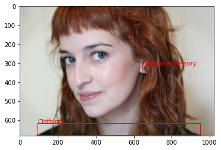

nonpersons_data
=================

## Overview
This repository contains code for removing person related bounding boxes from annotated data, downloaded from Google open image V6 dataset for object detection application https://storage.googleapis.com/openimages/web/index.html 

**Keywords:** bounding box, annotations, labels.

## Usage

### Dependencies

- [Python 3.8.5](https://www.python.org/downloads/)
- numpy 1.19.2(https://numpy.org/install/)
- pandas 1.1.3 (https://anaconda.org/anaconda/pandas)
- matplotlib 3.3.2 (https://anaconda.org/conda-forge/matplotlib)

### Step 1: 

Open a linux terminal and clone this repository to your workspace using:
```
git clone https://github.com/prchinmay/nonpersons_data.git

```
### Step 2:

To generate non-persons labels, and download corresponding images from Google open image V6, run this command in the terminal:
```
bash script.sh

```
### Step 3:
To visualize the results, run this file using:
```
python3 plot.py 

```
## Results

Once all commands are run, the plots should look like this example image. You can notice that the bounding box locating the person is removed.


