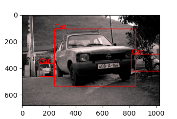
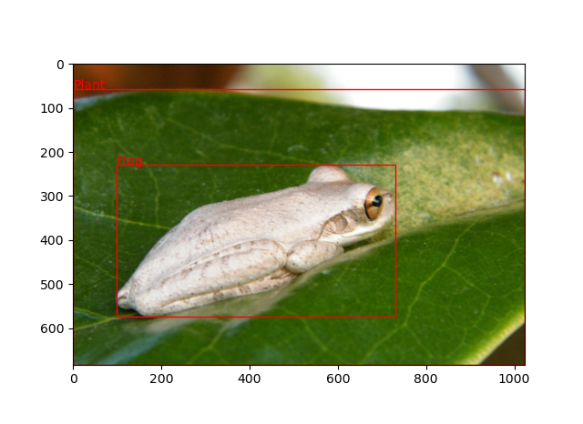
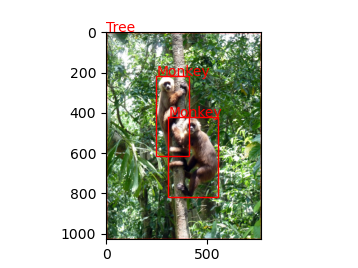
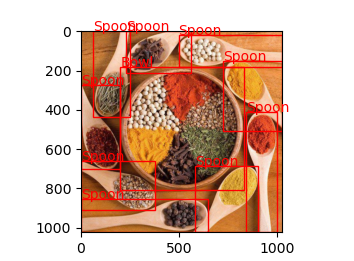

nonpersons_data
=================

## Overview
This repository contains code for downloading 2000 non-person images from Google open image V6 dataset for object detection applications (https://storage.googleapis.com/openimages/web/index.html).

## Usage

## Clone repository
Open a linux terminal and clone this repository to your workspace using(copy paste entire thing):
```
git clone https://github.com/prchinmay/nonpersons_data.git &
cd nonpersons_data

```

### Create new virtual environment
Before intalling dependencies, let us first create a new virtual environment using(copy paste the entire thing):
```
python3 -m pip install --user virtualenv &
python3 -m virtualenv env &
source env/bin/activate
```

### Install Dependencies
Install dependiencies using:
```
pip install -r requirements.txt

```

### Step 1:

After dependencies are installed, run this command in you linux terminal to generate non-persons ImageIDs and labels in YOLOv3 format. This script creates related folders, executes `filter.py` and `downloader.py`.
 
```
bash script.sh

```
### Step 2:
To visualize the results, run this file in you linux terminal using:
```
python plot.py 

```
## Results

Once all commands are run, the plots should look like this example image. Those classes that were chosen to be deleted from `filter.py` should not appear in the images. Everytime the script is run, it shows 10 random images with bounding boxes.




There should be 2000 images in `data/images` folder and 2000 annotation files in `data/labels`. The annotation files are in the format `XMin, YMin, XMax, Ymax, Class_id`

## Customizing

### Change split
The code is written assuming that you downloaded validation set annotations. If you want to download images from training set/test set, download the appropriate annotation files from https://storage.googleapis.com/openimages/web/download.html. Refer to the image below to know which files to download. In this example, I have downloaded only validation annotations.


Once downloaded, make sure that you also change the respective file names in the imports section of file `filter.py`
```
annot = pd.read_csv (r'validation-annotations-bbox.csv')
v_annot = pd.read_csv (r'validation-annotations-human-imagelabels-boxable.csv')

```
### Select which class to remove
Select the classes to remove in `filter.py`

```
class_to_remove = ['Person','Man','Boy','Girl', 'Mammal','Woman', 'Human mouth', 
                   'Human body', 'Human foot', 'Human leg', 
                   'Human ear', 'Human hair', 'Human head',
                   'Human arm','Human face', 'Human nose',
                   'Human hand', 'Human eye', 'Human beard']
```

### Change number of images to download

Select the number of images to download in `filter.py`

```
n_images = 2000 

```


